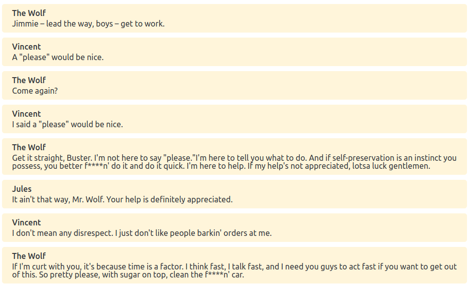

# Clyde - Dialogue Language

<p align="center"></p>

Clyde is a language for writing game dialogues. It supports branching, translations and interfacing with your game through variables and events.

You can play with the online editor [here](https://viniciusgerevini.github.io/clyde-js/).

Here is a simple dialogue:
```

The Wolf:   Jimmie – lead the way, boys – get to work.
Vincent:    A "please" would be nice.
The Wolf:   Come again?
Vincent:    I said a "please" would be nice.
The Wolf:   Get it straight, Buster. I'm not here to
            say "please."I'm here to tell you what to
            do. And if self-preservation is an
            instinct you possess, you better f****n'
            do it and do it quick. I'm here to help.
            If my help's not appreciated, lotsa luck
            gentlemen.
Jules:      It ain't that way, Mr. Wolf. Your help is
            definitely appreciated.
Vincent:    I don't mean any disrespect. I just don't
            like people barkin' orders at me.
The Wolf:   If I'm curt with you, it's because time is
            a factor. I think fast, I talk fast, and I
            need you guys to act fast if you want to
            get out of this. So pretty please, with
            sugar on top, clean the f****n' car.
```
This dialogue results in something like this:




This is just a simple example. There are many features not included above, like branching, variations, tags and ids.

You can read the complete language definition with examples on [LANGUAGE.md](./LANGUAGE.md).

## Tools

- Godot game engine plugin: [repository](https://github.com/viniciusgerevini/godot-clyde-dialogue).
- JS/TS interpreter and CLI: [repository](https://github.com/viniciusgerevini/godot-clyde-dialogue).
- Vim/Neovim [syntax highlighting](https://github.com/viniciusgerevini/clyde.vim).
- VSCode[syntax highlighting](https://github.com/viniciusgerevini/vscode-clyde).
- Online Editor and Interpreter: [Playground page](https://viniciusgerevini.github.io/clyde-js/).

