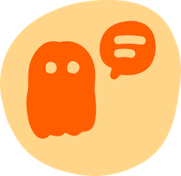

# Clyde Dialogue Language

Clyde is a language for writing game dialogues. It supports branching, translations and interfacing with your game through variables and events.

The [language definition](https://thisisvini.com/clyde/en/language) should be used to implement interpreters and parsers. Proposals can be sent via issues.

This repository holds the docs and changelog for the language and related tools. Check the [documentation](https://thisisvini.com/clyde) for more details.

## Contact

If you are looking for help on how things work, general questions, ideas to improve the language or just want to share something, please use our main discussion forum: https://github.com/viniciusgerevini/clyde/discussions

I also would love to see what games you've been making with Clyde. If you have any released game using clyde, share it with us on: https://github.com/viniciusgerevini/clyde/discussions/3
