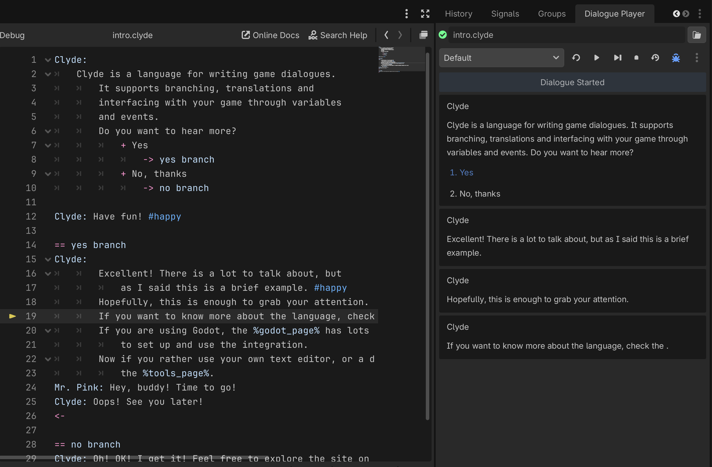
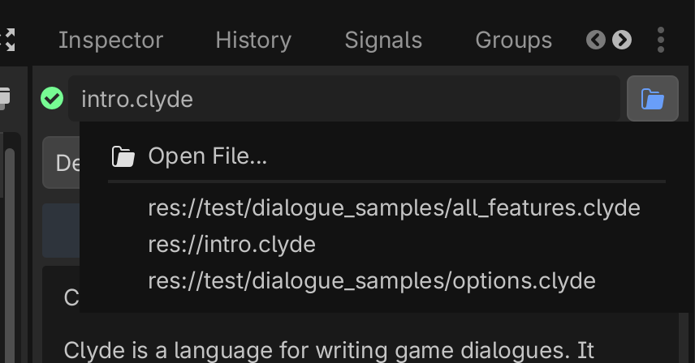
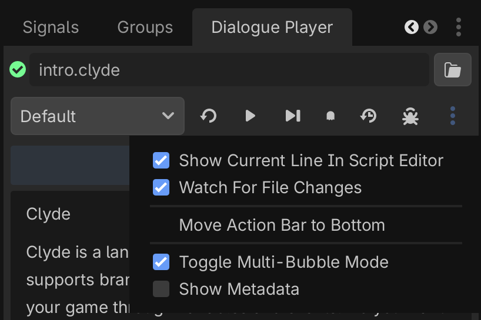

<!--
nav_max: 1
custom_page_class: player-usage
-->
# Player's Usage

The Dialogue Player allows you to execute dialogues inside the editor without executing the actual project. This allows for quick validation and feedback. Paired with the debbugger window you can set and modify any variable name to easily test conditions, branches and variations.

## Opening the Dialogue Player

When you first install the plugin, the Dialogue Player should be available on the right hand side dock. The player is a native dock, so you can choose the best location for it as you would with any other dock. You can close and open it at any time.

You can re-open the player in a few different ways:

- Via the Editor Docks menu in "Editor > Editor Docks > Dialogue Player"
- In the Script Editor, by right-clicking any `*.clyde` file and selecting "Open in Dialogue Player"
- In the FileSystem dock, also by right-clicking any `*.clyde` file and selecting "Open in Dialogue Player"
- In the Tools menu, "Project > Tools > Clyde > Open Dialogue Player"

## Executing Dialogues

To load a dialogue you can use the button with the folder icon in the player's top right corner.
This menu will show a list with all open `*.clyde` files and give you the option to open a new one.

You can also open a specific Clyde file from the Script Editor script list and FileSytem list by right-clicking the file and selecting "Open in Dialogue Player".

Once the file is loaded, you can click anywhere in the player and it will execute the next line, showing the current executing line in the Script Editor.

You can also click any of the Dialogue bubbles to locate the line in the Clyde file in the Script Editor.

_Note: Due to Godot Editor's limitation, the plugin cannot programmatically open a Dialogue file in the script editor. This means if you have a file open in the player and not in the Script Editor, you won't be able to use the features mentioned above_

## Action bar

In the action bar you fill find the following buttons:

__Block Selector__: This allows you to select which block from the dialogue file to execute.

__Restart Dialogue__: Restart the current dialogue from the begining. This will not clean the player's internal memory, so it will remember any option used, variation triggered, and variable set.

__Next Line__: Get next dialogue line. This is the same as clicking in the player itself.

__Forward to Next Choice__: Automatically get dialogue lines and stop if an option/branch is returned so you can select an option.

__Poltergeist Mode (auto-select)__: Automatically get dialogue lines till the dialogue reaches an end. When it finds an option/branch, it picks one at random and continues the dialogue. This is useful for monkey-testing your dialogue and finding edge cases.

__Clear Memory__: Restart the dialogue and cleans the internal memory. Any variable, single-use options and variations will be reset to the initial/unitialized state.

__Show Debug Panel__: Open the Debug Panel in the bottom dock. This panel allows you to set and change variables and inspect variables and events triggered in your dialogue.

### Overflow menu

In the overflow menu (three dots on the right side) you will find the following options

__Show Current Line in Script Editor:__ When selected, the Script Editor will follow the current line being executed.

__Watch for File Changes:__ When selected, the player will automatically reload and parse the dialogue when it detects the source file has changed.

__Move action bar to (top/bottom)__ Changes the position of this bar.

__Toggle Multi-Bubble Mode:__ When selected, all dialogue lines are shown in sequence, like a text chat. If not selected, only the last dialogue line will be shown. It can be changed while executing the dialogue without losing the context.

__Show Metadata:__ When selected, the line metadata, such as ids and tags, is shown in the bubble.

### Other Features

- When clicking a dialogue bubble, the player locates and shows the source line in the Script Editor.
- On the top-left part you can see a status indicator, which shows if the dialogue is parsing, succeeded or failed. If the dialogue fails parsing, the player shows the error message in the timeline and when hovering this indicator.
- You can also open files from outside your project to test them.
