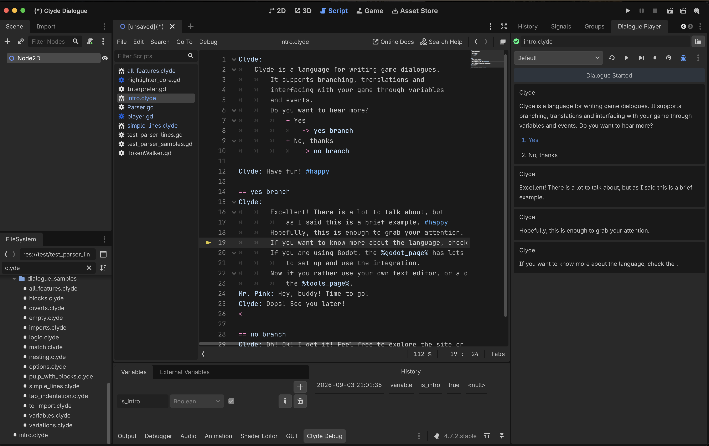
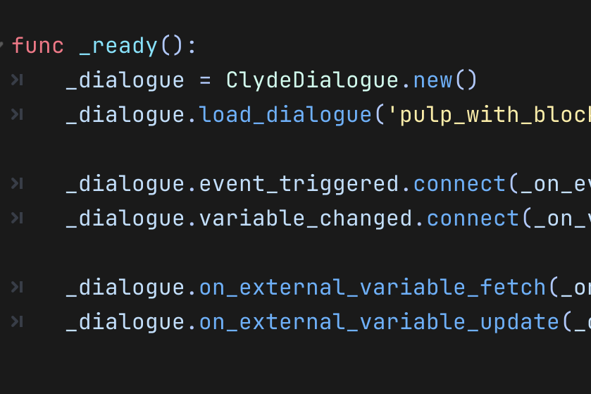
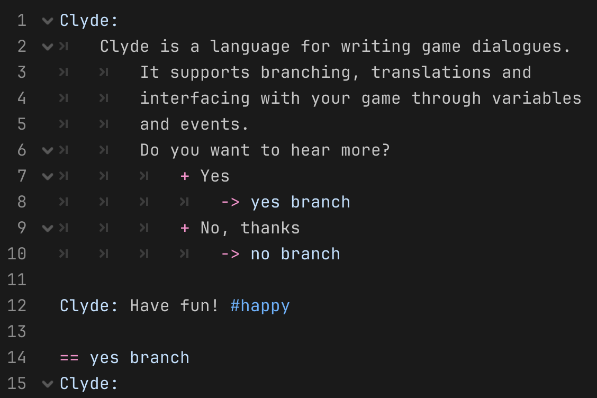
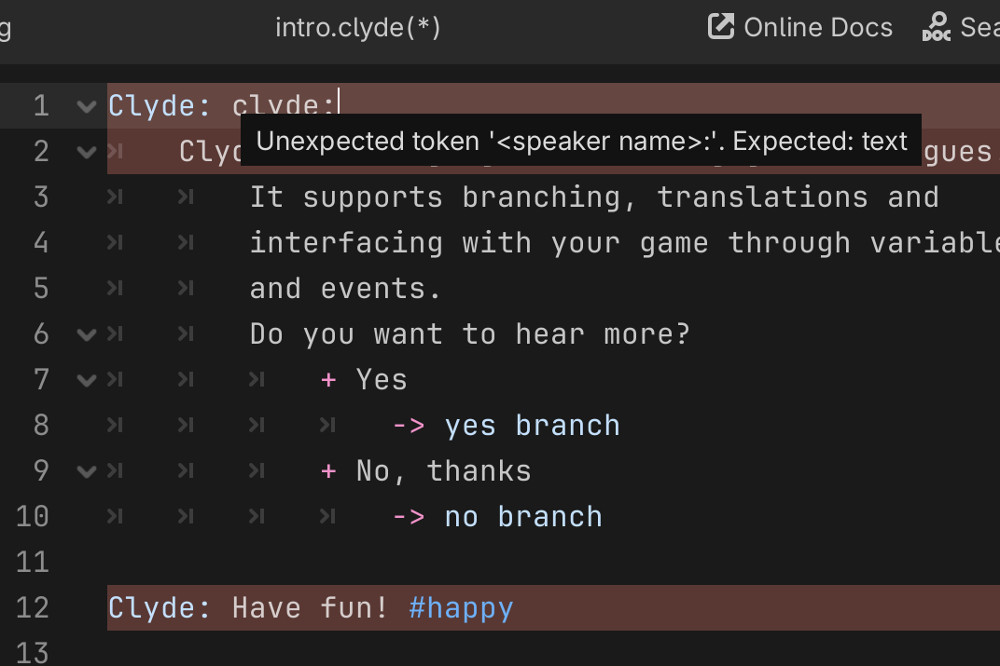
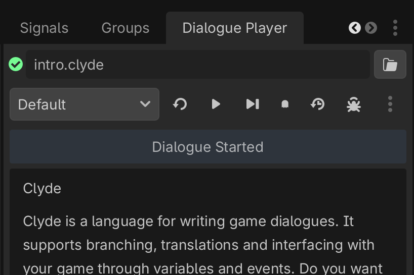
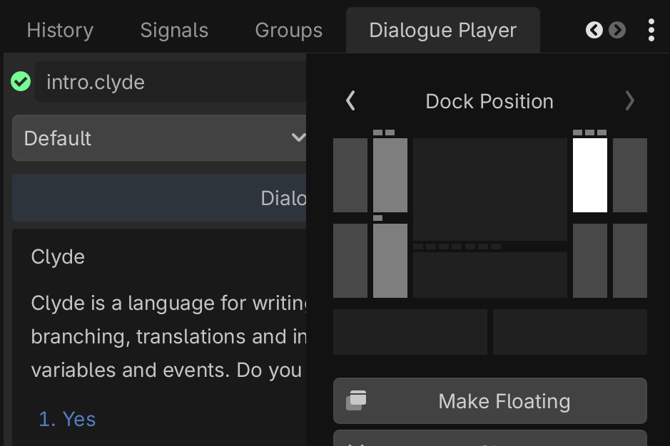
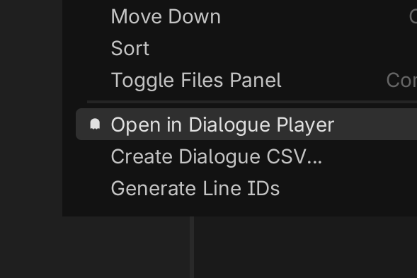
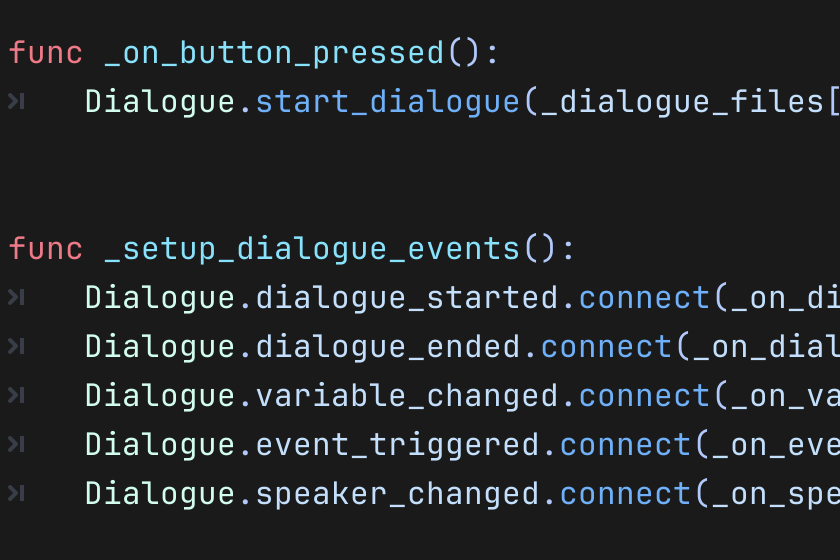

<!--
page_title: Godot Plugin
custom_page_class: godot-features-page
-->
# Clyde Dialogue Plugin for Godot

The Clyde Dialogue Plugin for Godot is a native GDScript implementation with zero external dependencies.

## Features

Interpreter and importer to parse Clyde files and improve runtime performance.

Syntax highlighting in Godot's internal script editor.

Reports syntax errors in the editor as you write your dialogue.

In-editor player and debugger that allows testing your dialogues without running your project.

The player is a native dock which allows it to be undocked and positioned wherever you find best.

Include tools to help with generating files for localization.

Optional helpers with opinionated implementation for a quicker start.

You can find more details about each one of these features in the next sections.

