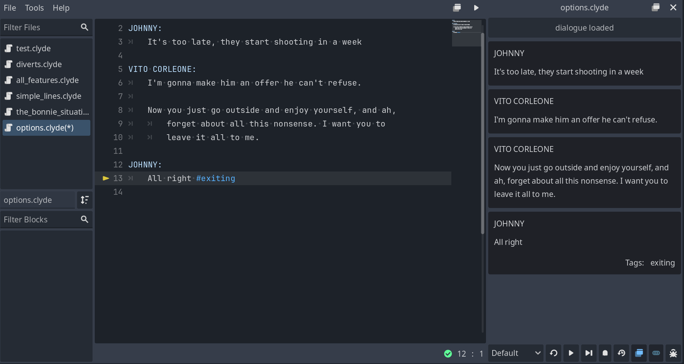
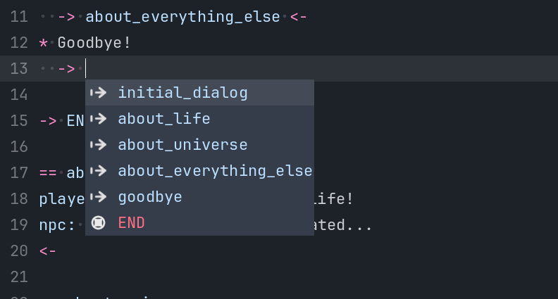
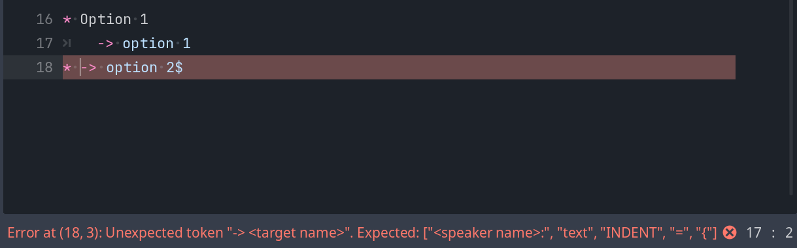
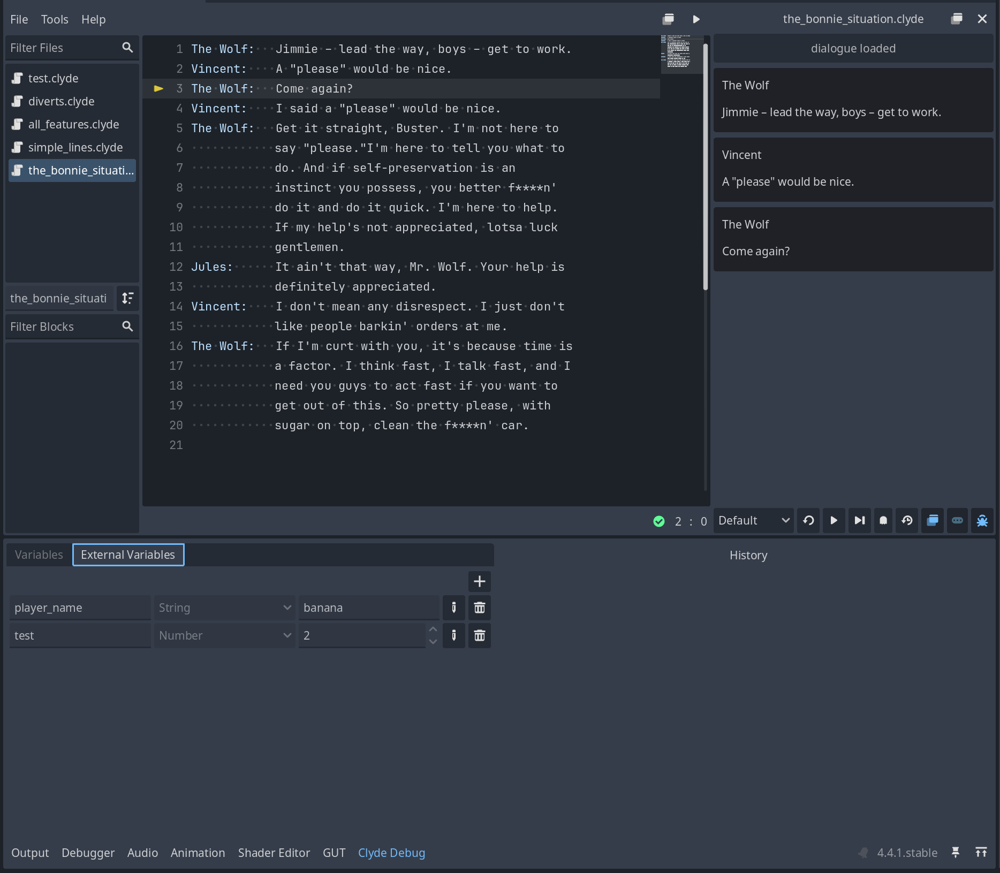
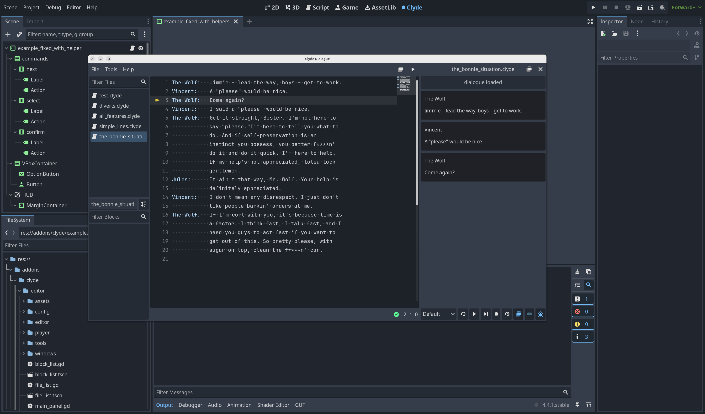
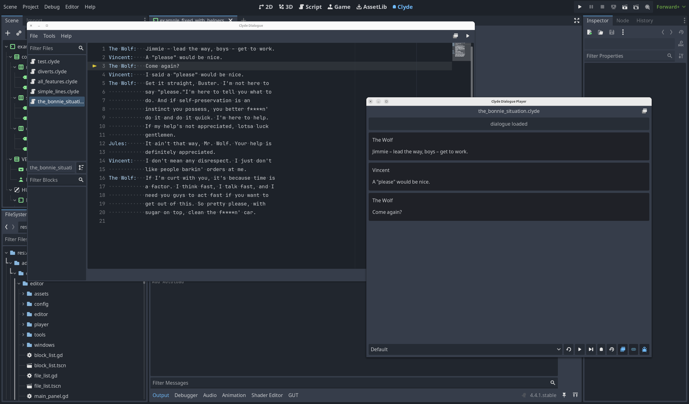
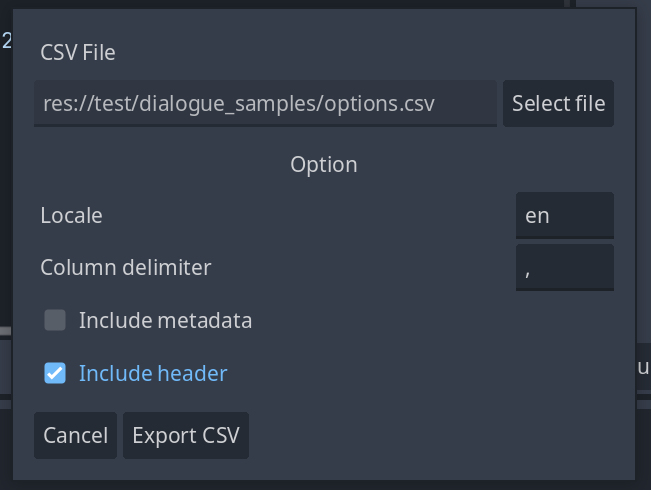

<!--
custom_page_class: features-page
-->
# Features

The Godot plugin makes authoring dialogues with clyde a breeze.

## Editor with syntax highlighting

Clyde is very flexible, and the syntax highlighting makes it easier to ensure your dialogue is correct.

Simple autocomplete to help you save time:

Parsing in real-time helps identifying errors quickly:

## In-editor player and debugger

You can execute your dialogue without running your game. It allows quick dialogue iteration and debugging.

## Undock editor and player

Need more space? You can undock both the editor and player into separate windows:

## Tools for localization

Useful tools for generating ids and exporting your dialogue lines for translation:

## Helpers for people in a rush

Opinionated, yet extensible helpers for a quicker start. Like the `Dialogue` singleton and a few built-in dialogue bubbles that can be adapted to your needs.

## Automatic importer

`.clyde` files are parsed at import time, improving runtime performance.
