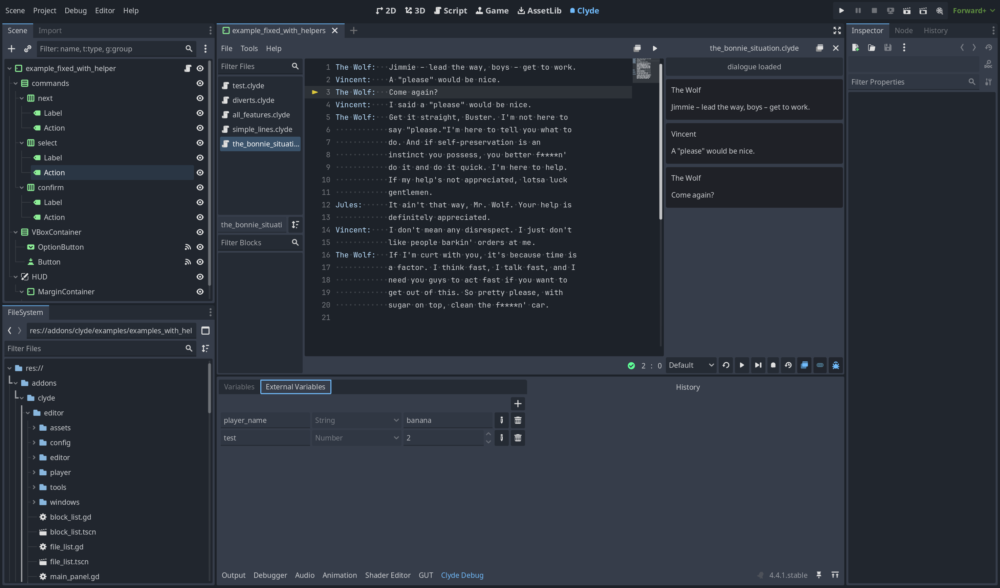

# Clyde Dialogue Plugin for Godot

Importer, interpreter and editor for [Clyde Dialogue Language](https://github.com/viniciusgerevini/clyde). Completely written in GDScript. No external dependencies.

- Editor with syntax highlighting
- Dialogue player with debugger to test dialogues without having to run the game
- Tools to help export dialogue lines for localization
- A few helpers for opinionated, but easier start
- Importer to automatically import `.clyde` files, improving runtime performance.

Check the [usage](./2-usage.md) page for how to use the interpreter.

